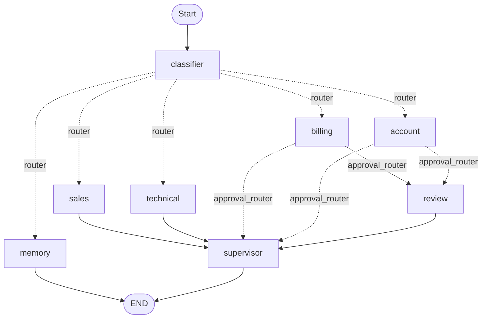

# AI Customer Support Automation System

A multi-agent customer support automation platform built using **LangGraph**, **LangChain**, **Ollama**, **ChromaDB**, and **SQLite**. 

The system automates department routing, retrieves relevant company policies and documentation via Retrieval-Augmented Generation (RAG), prompts support managers for human-in-the-loop validation on critical actions (like billing refund requests), and utilizes database session memory to recall past issues.

---

## Architecture & Workflow

The LangGraph system routes requests through the following workflow:



### Components:
1. **Hybrid Intent Classifier**: A deterministic keyword-checking layer maps common queries immediately. Any ambiguous requests fall back to an Ollama LLM intent classifier.
2. **Department Agents (Sales, Technical, Billing, Account)**: Specialized nodes that query a Chroma DB vector database using `nomic-embed-text` embeddings, retrieving relevant support context to answer customer questions.
3. **Supervisor Agent**: A validation node that improves and refines responses generated by support agents to guarantee they remain polite and accurate.
4. **Human Review Node**: A human-in-the-loop checkpoint that intercepts high-risk actions (e.g., refund requests, cancellation, account closures) and requests approval before outputting the supervisor's polished result.
5. **SQLite Memory Store**: Persists chat history dynamically to SQLite and recalls the second-to-last user support issue when queried.

---

## Screenshots

The mock screenshots representing the dashboard panels and workflows are located in the `/screenshots` directory:
- **Agent Routing** (`screenshots/agent_routing.png`): Demonstrates query intent classification and node routing.
- **RAG Retrieval** (`screenshots/rag_retrieval.png`): Shows the vector DB search and context extraction.
- **Human Approval** (`screenshots/human_approval.png`): Displays the supervisor approval modal for refund processing.
- **Memory Recall** (`screenshots/memory_recall.png`): Shows historical conversation retrieval from SQLite.
- **Final Response** (`screenshots/final_response.png`): Contrasts agent raw drafts with supervisor-polished, polite output.

---

## Setup & Running

### 1. Install Dependencies
Ensure you have Python installed, then run:
```bash
pip install -r requirements.txt
```

### 2. Set Up LLM and Embeddings
Start your local Ollama service and download the required models:
```bash
# Model for support reasoning and formatting
ollama pull llama3.2:3b

# Model for RAG vector embeddings
ollama pull nomic-embed-text
```

### 3. Compile the Vector Database
Load and index the text documents in `rag/documents/` into the Chroma persistent DB:
```bash
python rag/vectorstore.py
```

### 4. Run the Customer Support App
Launch the interactive command-line interface:
```bash
python app.py
```

Type queries in the CLI (e.g., `"I need a refund for my annual subscription"` or `"What was my last issue?"`) and type `exit` to quit.
